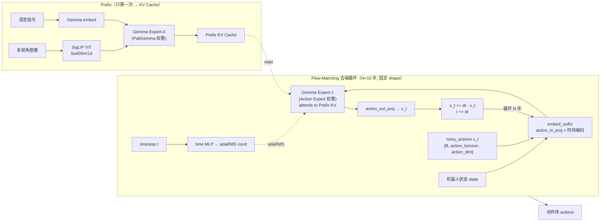
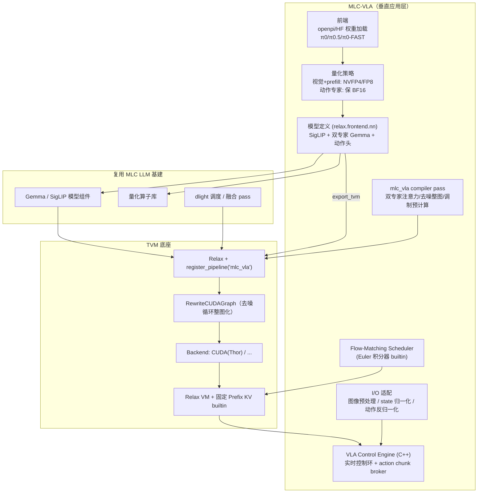

# MLC-VLA 架构设计

> **一句话定位**：MLC-VLA 是 **TVM 的第二个垂直领域实现**（与 MLC LLM 平级）——把 TVM 通用 ML 编译器底座针对 **VLA（Vision-Language-Action）/ 流匹配动作生成** 场景做满配。第一个落地目标是 **π0.5**。
>
> 设计原则：**最大化复用 MLC LLM 基建，最小化新增 VLA 特有部分**。

---

## 目录

1. [定位与设计哲学](#1-定位与设计哲学)
2. [π0.5 模型结构拆解](#2-π05-模型结构拆解)
3. [与 LLM 的关键差异](#3-与-llm-的关键差异)
4. [复用 vs 新建矩阵](#4-复用-vs-新建矩阵)
5. [整体架构](#5-整体架构)
6. [三块新建部分的设计](#6-三块新建部分的设计)
7. [编译 Pipeline：mlc_vla](#7-编译-pipelinemlc_vla)
8. [与端侧优化方法论的对齐](#8-与端侧优化方法论的对齐)
9. [落地路线图](#9-落地路线图)
10. [风险与取舍](#10-风险与取舍)
11. [参考与代码索引](#11-参考与代码索引)

---

## 1. 定位与设计哲学

对照 **MLC LLM 之于 TVM** 的关系，MLC-VLA 同理：**不 fork 编译器内核，只在 TVM 扩展点上注册 VLA 专用内容**。它与 MLC LLM 是**平级的兄弟**，不应塞进 MLC LLM（否则污染纯文本 LLM 的 serving 路径）。

```
TVM（通用编译器底座：Relax / TIRX / VM / Codegen / Disco）
  ├── MLC LLM   （垂直实现①：自回归文本生成）
  └── MLC-VLA   （垂直实现②：多模态 → 流匹配动作生成）  ← 复用 MLC LLM 的模型/量化/算子基建
```

**结论**：应该做 `mlc-vla`，但不是从零造轮子。π0.5 的视觉和 LLM prefill 段与 MLC LLM 高度同构（SigLIP/Gemma 都是 transformer），真正需要新建的只有三块：

1. **双专家（Mixture-of-Transformers）联合注意力**
2. **flow-matching 去噪循环**
3. **连续动作 I/O 与实时控制 Engine**

---

## 2. π0.5 模型结构拆解

> 依据：`model_optimizer/third_party/openpi/src/openpi/models/pi0.py`

π0.5 不是普通 LLM，而是 **VLM 主干 + 流匹配动作专家** 的复合体：



关键事实（直接对应代码）：

| 事实 | 来源 | 对架构的影响 |
|------|------|--------------|
| **双专家共享注意力**：`_gemma.Module(configs=[paligemma, action_expert])` | `pi0.py:73-80` | prefix 走 expert-0 权重、suffix 走 expert-1 权重，但**联合做一次 attention**（suffix 读 prefix KV）。MLC LLM 没有的「Mixture-of-Transformers」 |
| **prefix KV 只算一次**，去噪循环复用 | `sample_actions:233-237` | 不需要 PagedKVCache 的增长式分页，只要**固定长度 prefix cache** |
| **flow matching 去噪**：`dt=-1/num_steps`，Euler 积分 `x_t += dt·v_t` | `sample_actions:228,271` | 输出端**不是采样 token**，而是连续向量定步迭代；固定 shape → CUDA Graph 友好 |
| **pi05 用 adaRMS**：time MLP 产生调制条件 | `pi0.py:93-95,162-169` | 去噪每步注入 timestep 条件，调制量只依赖步序 → **可预计算** |
| 输出 `[B, action_horizon, action_dim]` 动作块 | `sample_actions:278` | I/O 适配层做 **action 反归一化 + chunk 分发**，无 tokenizer detokenize |

---

## 3. 与 LLM 的关键差异

| 维度 | MLC LLM（自回归文本） | MLC-VLA（π0.5 流匹配） |
|------|------------------------|--------------------------|
| 输入 | 文本 token | 多视角图像 + 语言指令 + 机器人状态 |
| 主干 | 单专家 transformer | **双专家**（VL 专家 + 动作专家）联合注意力 |
| 生成方式 | 自回归逐 token 采样 | **固定步数 flow-matching 去噪**（Euler 积分） |
| KV cache | PagedKVCache，随解码增长 | **固定长度 prefix KV**，只算一次、去噪只读 |
| 输出 | 离散 token → detokenize | 连续动作块 → 反归一化 |
| 计算特征 | decode 段 memory-bound | 去噪段 **launch-bound**（小算子多） |
| Serving | 多请求吞吐 + continuous batching | **单请求实时控制环** + action chunk 分发 |

---

## 4. 复用 vs 新建矩阵

| 能力 | TVM 提供 | MLC LLM 可复用 | MLC-VLA 需新建 |
|------|----------|----------------|----------------|
| IR / Codegen / VM | ✅ 全部 | — | — |
| SigLIP ViT 建模 | nn frontend | ≈（`model/vision/clip_vision.py` 改 SigLIP） | 微调 |
| Gemma backbone | nn frontend | ✅（`model/gemma`） | — |
| 量化（视觉/prefill FP8/NVFP4） | quant 框架 | ✅ `quantization/` | 动作专家 no-quant 开关 |
| dlight / MetaSchedule 调度 | ✅ | ✅ | — |
| **双专家联合注意力** | attention 原语 | ❌（单专家） | ✅ 新 op + pass |
| **固定 prefix KV cache** | KV state builtin | ≈（简化 PagedKVCache） | ✅ 简化版 |
| **flow-matching 去噪循环** | Relax 控制流 + CUDA Graph | ❌ | ✅ 新 runtime scheduler |
| **连续动作 I/O** | — | ❌（token） | ✅ 输入/输出适配层 |
| Serving Engine | VM 执行 | ⚠️ 文本 Engine 不适用 | ✅ 实时控制 Engine |
| 多模型混跑编排 | Disco / stream | — | ✅（与感知/安全同跑） |

> 估算：**约 60-70% 基建可复用**，新增工作集中在「双专家注意力 + 去噪循环 + 控制 Engine」三处。

---

## 5. 整体架构



### 建议目录结构（仿 mlc_llm）

```
mlc-vla/
├── python/mlc_vla/
│   ├── model/
│   │   ├── pi0/                 # π0 / π0.5 模型定义 + loader
│   │   ├── vision/siglip.py     # SigLIP ViT（改自 clip_vision）
│   │   └── gemma_dual_expert.py # 双专家 Gemma backbone
│   ├── nn/
│   │   ├── dual_expert_attention.py  # 双专家联合注意力
│   │   ├── prefix_kv_cache.py        # 固定长度 prefix KV
│   │   └── flow_matching.py          # 去噪循环建模
│   ├── op/                      # VLA 专用算子
│   ├── compiler_pass/
│   │   ├── pipeline.py          # register_pipeline("mlc_vla")
│   │   ├── dispatch_dual_expert_attention.py
│   │   ├── precompute_denoise_modulation.py
│   │   └── denoise_loop_cuda_graph.py
│   ├── quantization/            # 复用 + 段级 no-quant 开关
│   ├── serve/                   # VLA 实时控制 Engine（Python 侧）
│   ├── interface/compile.py     # 编译入口
│   └── cli/
├── cpp/serve/                   # C++ 实时控制 Engine
├── 3rdparty/tvm/                # TVM 子模块
└── docs/arch.md                 # 本文档
```

---

## 6. 三块新建部分的设计

### 6.1 双专家联合注意力（Mixture-of-Transformers）

与 LLM 最本质的不同。设计为新的 attention op + dispatch pass：

- **QKV 投影按 token 段分权重**：prefix 段用 expert-0 的 `Wq/Wk/Wv`，suffix 段用 expert-1 的。
- **attention 联合计算**：在 `[prefix; suffix]` 拼接序列上做一次 masked attention（mask 来自 `make_attn_mask`：prefix 内部双向、suffix 对 prefix 单向）。
- **实现路径**：
  - 建模层 `mlc_vla/nn/dual_expert_attention.py`：两套 `nn.Linear` + 共享 attention core。
  - 新 pass `DispatchDualExpertAttention`：lower 到 TVM 的 FMHA backend（prefill 段）/ 去噪段固定形状 attention，复用 TVM `attn_backend` 但喂入分段权重。

### 6.2 Flow-matching 去噪循环（launch-bound 主战场）

对应 `sample_actions` 的 while_loop。TVM 路线的杀手锏是 **固定 shape + RewriteCUDAGraph**：

- **建模**两种策略：
  - **A. 固定步数展开（推荐 MVP）**：`num_steps=10` 编译期常量 → 循环展开 → `RewriteCUDAGraph` 整图化（去噪段从几百 kernel → 1 个 graph）。
  - **B. Relax 控制流 while-loop**：步数运行期可变，CUDA Graph 收益打折。
- **新 pass `PrecomputeDenoiseModulation`**：adaRMS 调制量只依赖 `timestep`（步序），与观测无关 → 预计算成常量表，砍掉每步 time MLP 的 Dense GEMM。
- **新 builtin `vm.builtin.flow_matching_euler_step`**：封装 `x_t += dt·v_t`，类比 MLC LLM 的 `sample_top_p_from_prob`，作用在连续动作上。
- **固定 Prefix KV**：`mlc_vla/nn/prefix_kv_cache.py`，简化 TVM PagedKVCache —— prefix 长度编译期已知、不增长、去噪 N 步只读不写。

### 6.3 实时控制 Engine（cpp/serve 的 VLA 版）

MLC LLM 的文本 Engine（batching / streaming / grammar）不适用，需新建轻量实时 Engine：

| 模块 | 职责 | 类比 |
|------|------|------|
| 输入适配 | 多路图像预处理、state 归一化、prompt tokenize | openpi `transforms.py` |
| 推理驱动 | `prefill`（算 prefix KV）→ `denoise`（CUDA Graph）→ 输出 v | `cpp/serve/model.cc` |
| 输出适配 | 动作反归一化、action chunk 分发 | openpi `action_chunk_broker.py` |
| 控制环 | 固定频率触发、与感知/安全模型混跑编排 | 端侧混跑方法论 |

> VLA 是**单请求实时控制**（非多请求吞吐），去掉 continuous batching、prefix radix tree 等 LLM serving 复杂度，换成**确定性低延迟 + 动作块缓冲**。

---

## 7. 编译 Pipeline：mlc_vla

在 MLC LLM pipeline 基础上增删（**粗体**为 VLA 新增）：

```
Phase 0  AttachPrefixKVCacheCreation（固定长度，替代 PagedKVCache）
         **DispatchDualExpertAttention**
         **PrecomputeDenoiseModulation**（adaRMS 调制预计算）
         AttachVariableBounds（action_horizon / prefix_len）
Phase 1  视觉/prefill 段:  FuseTransposeMatmul / FuseAddRMSNorm / BLASDispatch
         **去噪段标记 no-quant**（保 BF16，量化对 launch-bound 无效）
Phase 2  LegalizeOps → FuseOps → FuseTIR（复用 TVM zero pipeline）
Phase 3  FuseDequantizeMatmulEwise（仅视觉/prefill）
Phase 4  dlight: 视觉/prefill 走 Matmul/GEMV；去噪小算子走 Fallback + 整循环
Phase 5  StaticPlanBlockMemory
         **DenoiseLoopCUDAGraph**（去噪固定 shape → 单 CUDA Graph，核心收益）
         LowerAllocTensor → VMShapeLower → AttachGlobalSymbol
```

---

## 8. 与端侧优化方法论的对齐

> 参考：`myDocs/AI/optimizer/arch.md` §13（π0.5 on Thor MVP）

MLC-VLA 不追求「全 TVM」，而是**按段选最优**，落在方法论的异构映射结论上：

| 阶段 | MLC-VLA 后端选择 | 依据 |
|------|------------------|------|
| 视觉 SigLIP | TVM 编译器引擎 + 多视角 batch + NVFP4 | compute-bound，编译器完胜 |
| LLM prefill | TVM 编译器引擎 + FP8 KV | compute-bound，量化收益大 |
| 去噪循环 | TVM + **整循环 CUDA Graph**（先试）→ 不足再退手写 runtime | launch-bound；RewriteCUDAGraph 拿大部分 |

> **诚实的取舍**：方法论 §13.3 实测去噪段手写 runtime 还能再快 ~37%。MLC-VLA 的价值在于**用编译器路径拿到 ~80% 收益 + 全流程可维护/可移植**；若某平台对最后那段延迟极度敏感，保留「去噪段替换为手写 runtime」的 BYOC 扩展点（TVM `call_packed` 挂外部 kernel）。

四类瓶颈与主攻维度对应（来自方法论 §13.1）：

| 阶段 | 计算特征 | 瓶颈类型 | 主攻维度 |
|------|----------|----------|----------|
| 视觉 SigLIP 编码 | 大 GEMM/卷积、可 batch 多视角 | compute-bound | 计算（量化 + 融合） |
| LLM prefix prefill | 长序列大 GEMM | compute-bound | 计算（FP8/NVFP4 + FMHA） |
| 多步去噪 | 小 batch × N 步，小算子多 | **launch-bound** | 调度（整循环 + CUDA Graph） |
| KV 传递 | 阶段间拷贝 | memory-bound | 内存（零拷贝/FP8 KV） |

---

## 9. 落地路线图

| 阶段 | 目标 | 交付 | gate |
|------|------|------|------|
| **M0 打通** | π0.5 单步前向在 TVM 跑通（视觉+prefill+单步去噪），CPU/单 GPU | 模型定义 + 基础 pipeline | 数值对齐 openpi（cosine） |
| **M1 去噪整图** | N 步去噪 + RewriteCUDAGraph，kernel 数验证 | `DenoiseLoopCUDAGraph` + 固定 Prefix KV + Euler builtin | nsys 确认 kernel 数下降 |
| **M2 双专家+量化** | 双专家注意力正确 + 视觉/prefill NVFP4/FP8 | `DispatchDualExpertAttention` + 量化开关 | **任务成功率** |
| **M3 实时 Engine** | Thor 上实时控制环，action chunk 分发 | C++ VLA Engine + I/O 适配 | 端到端延迟/功耗 |
| **M4 混跑编排** | 与感知/安全模型共置 | stream 优先级 / green context + nsys 验证 | SLO + p99 抖动 |

每阶段守住「**数值对齐 + 任务成功率**」双 gate（避免方法论反模式：只看 cosine 不看任务指标）。

### 第一步（M0）具体任务清单

1. 写 Flax → MLC 权重 loader（参考 `mlc_llm/model/*/\*_loader.py`），把 openpi π0.5 checkpoint 映射到 MLC 命名。
2. 用 `tvm.relax.frontend.nn` 描述：SigLIP ViT、双专家 Gemma（先用朴素 masked attention 保证正确性）、action_in/out_proj、time MLP。
3. 实现 `embed_prefix` / `embed_suffix` / 单步 `denoise` 的 Relax 计算图。
4. 基础 `mlc_vla` pipeline（先不上 CUDA Graph、不量化），`relax.build` 到 CPU/单 GPU。
5. 与 openpi（JAX）对拍单步 `v_t`，cosine ≥ 阈值即 M0 通过。

---

## 10. 风险与取舍

| 风险 | 缓解 |
|------|------|
| 双专家注意力在 TVM attn_backend 无现成支持 | M0 先用朴素 masked attention 跑通正确性，再 dispatch 到 FMHA |
| 去噪 while-loop 动态步数与 CUDA Graph 冲突 | MVP 固定 `num_steps` 编译期常量，展开后整图化 |
| openpi 是 JAX/Flax（`nnx`），权重需转换 | M0 写 loader：Flax 参数 → MLC 命名映射 |
| 去噪段量化无收益反掉精度 | pipeline 显式标记动作专家 no-quant |
| 实时性受 big.LITTLE CPU 喂食瓶颈 | 绑核 + 减少 host launch（CUDA Graph 正好减 launch） |

---

## 11. 参考与代码索引

| 关注点 | 路径 |
|--------|------|
| π0.5 参考实现（JAX） | `model_optimizer/third_party/openpi/src/openpi/models/pi0.py` |
| π0.5 PyTorch 实现 | `.../openpi/src/openpi/models_pytorch/pi0_pytorch.py` |
| Gemma / SigLIP 组件 | `.../openpi/src/openpi/models/gemma.py`, `siglip.py` |
| action chunk 分发 | `.../openpi/packages/openpi-client/src/openpi_client/action_chunk_broker.py` |
| MLC LLM pipeline 参考 | `mlc-llm/python/mlc_llm/compiler_pass/pipeline.py` |
| MLC LLM 模型定义参考 | `mlc-llm/python/mlc_llm/model/llama/llama_model.py` |
| MLC LLM KV Cache 参考 | `mlc-llm/python/mlc_llm/nn/kv_cache.py` |
| TVM 架构总览 | `myDocs/AI/engineering/tvm/tvm.md`（第十章 MLC LLM） |
| 端侧优化方法论 | `myDocs/AI/optimizer/arch.md`（§13 π0.5 on Thor） |
