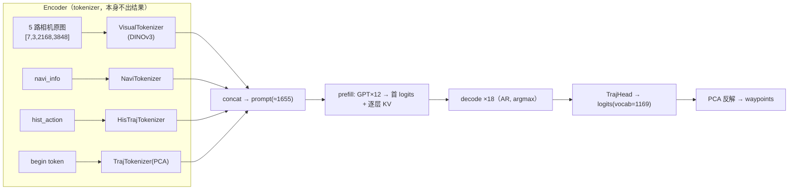

# MLC-VLA · plannn3 端到端规划器 · 开源 TVM 落地方案

> **一句话定位**：把 NIO 车端的 **plannn3**（多相机视觉 tokenizer → GPT prefill → 离散轨迹自回归解码）按 **mlc-vla 的姿势**（纯开源 TVM Relax，不 fork 编译器内核）落地为可编译、可推理的三段固定 shape 图。
>
> 设计原则：**照搬 mlc-vla（π0.5）的三段图骨架与工程约定，只替换模型差异部分**。

---

## 目录

1. [背景与定位](#1-背景与定位)
2. [plannn3 模型结构拆解](#2-plannn3-模型结构拆解)
3. [与 π0.5(mlc-vla) 的对应关系](#3-与-π05mlc-vla-的对应关系)
4. [整体架构：三段固定 shape 图](#4-整体架构三段固定-shape-图)
5. [关键设计](#5-关键设计)
6. [编译 Pipeline](#6-编译-pipeline)
7. [运行时编排](#7-运行时编排)
8. [非标准算子处理](#8-非标准算子处理)
9. [精度策略](#9-精度策略)
10. [落地路线图](#10-落地路线图)
11. [风险与取舍](#11-风险与取舍)
12. [参考与代码索引](#12-参考与代码索引)

---

## 1. 背景与定位

对照 **mlc-vla 之于 π0.5** 的关系，plannn3 同理可以作为 **TVM 的又一个垂直落地**：

```
TVM（通用编译器底座：Relax / TIR / VM / Codegen / dlight）
  ├── MLC LLM   （垂直实现①：自回归文本生成）
  ├── MLC-VLA   （垂直实现②：π0.5 多模态 → 流匹配动作生成）
  └── plannn3    （本方案：多相机视觉 → 离散轨迹自回归规划）
```

**结论**：不从零造轮子。plannn3 的视觉前端与 GPT prefill 段和 MLC LLM / mlc-vla 高度同构，可大量复用 relax nn 前端 + KV-cache API + dlight/cuBLAS/CUDA-Graph 基建。真正需要处理的差异只有：

1. **多编码器融合的输入**（视觉/navi/history_traj/traj 四路 tokenizer 拼接，而非单一查表）；
2. **离散轨迹自回归解码**（argmax 采样 ×18，KV 每步增长）；
3. **巨图 DINOv3 视觉前端**（数据相关 crop + 2D RoPE + SwiGLU + LayerScale）。

> NIO 车端已有 `ar_planner_v2`（mlc-llm fork + AllSpark）是同思路产物。本方案 = 把它做成**纯开源 TVM** 版本：去掉 AllSpark/HPC 私有算子，attention 用 relax 原语或 flashinfer BYOC 兜底。

---

## 2. plannn3 模型结构拆解

> 依据：`nio/plannn3/plannn3/model/network.py`、`.../encoder/*`、`.../head/trajectory_head.py`

plannn3 是 **多模态 token 拼接 + GPT 式 Causal Transformer + 离散轨迹 token 自回归生成** 的规划模型：



核心超参：`n_embd=1024`、`n_head=16`、`n_layer=12`、`bias=false`、`max_sequence_size=1656`；`Block = CausalSelfAttention(interleaved RoPE) + MLP`。

四段 `module_list`：`visual`(DINOv3, ≈1570 token) / `navi` / `history_traj`(4) / `traj`(1 begin，唯一带 head)。**只有 `traj_head` 出结果**（logits → argmax → 轨迹 token → 反解 waypoints）；视觉/navi/history_traj 只吐 embedding + `hist_img_feat` 时序缓存。

---

## 3. 与 π0.5(mlc-vla) 的对应关系

| | π0.5 (mlc-vla) | plannn3 |
|---|---|---|
| 前端 | SigLIP `embed_image` | DINOv3 `VisualTokenizer` + navi/history_traj tokenizer |
| 主干 | 双专家 Gemma + adaRMS | 单塔 GPT（12 层，interleaved RoPE） |
| prefill | expert-0 固化 prefix K/V | 整段 prompt(≈1655) 过 12 层 → 首 logits + 逐层 KV |
| 循环 | flow-matching Euler ×N（连续向量） | 自回归 ×18（离散 token，argmax） |
| 头 | `action_out_proj` | `TrajHead`(vocab=1169) → PCA 反解 waypoints |
| KV | prefix 固定，suffix concat | 定长 buffer + `valid_kv_len` + `where` 写入（每步增长） |

**同构点**：都是"视觉 tokenizer → prefill 固化 KV → 循环增量解码"的三段固定 shape 图，batch=1，KV 交接，宿主/图内两种循环。

---

## 4. 整体架构：三段固定 shape 图

照搬 mlc-vla 的多入口 `ModuleSpec` + 分段编译（每个 engine 只带自身权重）：

```text
encode          : (6 路输入) → token_embeds, next_hist_img_feat
prefill         : token_embeds → 首 token id + 逐层 KV cache[depth,1,nh,max_seq,hd]
decode_step_kv  : (KV cache, latest_id, valid_kv_len) → next id + KV delta
[可选] decode_loop_kv : 图内固定 18 步 AR 环（可整段 CUDA Graph）
```

对应参考实现：
- mlc-vla：`pi0_model.py` 的 `prefill` / `denoise_step_kv` / `denoise_loop_kv`；
- plannn3 现有 trace：`laser_model_export/.../plannn3/vanilla/relay.py` 的 `encode_prefill` / `decode_step`。

---

## 5. 关键设计

### 5.1 用 `tvm.relax.frontend.nn` 重写模型
- `VisualTokenizer(DINOv3)` / `NaviTokenizer` / `HisTrajTokenizer` / `TrajTokenizer` → 各自 `embed_*`；
- GPT `Block`（CausalSelfAttention + interleaved RoPE + MLP）→ backbone；
- `TrajHead`。

### 5.2 固定 shape 化（变长 → 定长 + 运行时量）
原生 `decode` 每步 concat 整段、序列递增、无 KV cache，无法 trace 成单一图。改造为：
- query 恒为 1 个 token（`[B,1,C]`）；
- KV cache 为**预分配定长 buffer** `[B, max_seq, 2*n_embd]`，prefill 填 `[0,s)`、其余置 0；
- 新 token 用 one-hot `step_mask` + `where` **覆盖写入**（无 concat、无 shape 变化）；
- 变化的"有效长度/写入位置"由 **`valid_kv_len`（`(1,)` tensor）** 传入，配合加性 mask（`indices<=pos` 保留、其余 `-inf`）复现变长语义。
- **`valid_kv_len` 必须是 tensor**，否则 trace 会把它常量折叠，图只对某一步正确。

### 5.3 采样与循环
- argmax 放图内（`op.argmax`）或宿主；
- 18 步 AR：宿主 loop（每步 `decode_step_kv`，参照 `PiZeroRunner.sample`）或图内 `decode_loop_kv`（固定 18 步、可 CUDA-graph，参照 `denoise_loop_kv`）。

---

## 6. 编译 Pipeline

纯开源 TVM（参照 `mlc_vla/compile.py`）：

```python
# GEMM 预处理（CUDA）：matmul 卸载 cuBLAS + 吃掉转置税
mod = partition_for_cublas(mod)
mod = relax.transform.RunCodegen()(mod)
mod = relax.transform.FuseTransposeMatmul()(mod)

ex = relax.build(
    mod, target=tvm.target.Target("cuda"),          # Orin=cuda；x86=llvm
    relax_pipeline=relax.get_default_pipeline(tgt),
)   # PassContext 可开 relax.backend.use_cuda_graph
vm = relax.VirtualMachine(ex, dev)
```

优化项：
- **cuBLAS BYOC**（不可用回退 **dlight**：`Matmul/GEMV/Reduction/Fallback`）；
- **CUDA Graph**（`use_cuda_graph`）——decode 单步或图内环整段捕获；
- **group int4 量化**（显存 ~2.5×↓；本工况轻计算下 dequant 可能略慢，收益主要在显存）。

分段编译：encode / prefill / decode 各出独立 `.so` + 打包权重（`include_for` 按导出函数裁子模块）。

---

## 7. 运行时编排

宿主 `VirtualMachine` 加载三段 engine，编排：

```text
encode(6 路输入) ─► token_embeds, next_hist_img_feat
     │
prefill(token_embeds) ─► first_id, KV_cache(定长 buffer)
     │
for i in range(18):                       # 或一次 decode_loop_kv
    id_{i+1}, kv_delta = decode_step_kv(KV_cache, id_i, valid_kv_len=prompt_len+i)
    KV_cache ← 写回 kv_delta 到槽位 (prompt_len+i)
     │
traj_ids(18) ─► TrajTokenizer.decode ─► waypoints
```

- `valid_kv_len` 与 KV delta 在 host 推进（对齐 `sample.euler_loop` 的做法）；
- `next_hist_img_feat` 跨帧持久化（有状态推理），下一帧回填 encode。

---

## 8. 非标准算子处理

| 算子 | 处理方式 |
|---|---|
| interleaved RoPE（LLM） | relax `split/mul/concat` 组合；cos/sin fp32 常量 bake 或传入 |
| 2D RoPE（DINOv3） | 同上，位置表按 patch 网格预算 |
| SwiGLU / GELU(tanh) | relax op 组合 |
| LayerScale / RMSNorm / adaRMS | relax op 组合（RMSNorm fp32 归一） |
| DINOv3 巨图 resize/crop（数据相关） | 独立 `vit` engine；crop offset 用 **tensor 传入**（不 bake），或放宿主预处理（PVA/hipp） |
| attention | 先 relax `matmul+softmax`（dlight 调度）；不够快再上 **flashinfer / cuBLAS BYOC** |

---

## 9. 精度策略

- **视觉/traj tokenizer 保 fp32**（原始交付强制 fp32 image cast + 离散 PCA tokenizer，不能改）；
- **GPT backbone + head 转 fp16/bf16**；
- **attention logits fp32 累加**，head logits fp32 出（argmax 稳定）；
- 用 mlc-vla 式 **parity**：连续输出（`next_hist_img_feat`）按 TF32 小容差、离散输出（`traj_ids`）**bit-exact** 对齐 golden。

---

## 10. 落地路线图

| 里程碑 | 目标 |
|---|---|
| **M0** | relax nn 重写 `encode/prefill/decode_step`，`target=llvm` 冒烟跑通，shape/dtype 自洽 |
| **M1** | 定长 KV buffer + `valid_kv_len` + `where` 写入；宿主 18 步 AR 环；cuda 目标跑通 |
| **M2** | dlight/cuBLAS + CUDA Graph + 图内 `decode_loop_kv`；与 golden 数值对齐（cosine + bit-exact） |
| **M3** | group int4 量化；分段编译出库；Orin 端到端延迟基线 |

---

## 11. 风险与取舍

- **DINOv3 巨图**：`[7,3,2168,3848]` 预处理是延迟大头，优先放独立 engine / PVA，避免 CPU 拷贝；
- **数据相关 crop**：`floor/clip` 控制流要 trace 友好化（offset 走 tensor）；
- **bit-exact 门槛**：任何算子替换都要重过 golden，混合精度上/下采点位要与参考一致；
- **attention 后端**：relax 原语在 max_seq≈1656 的 prefill 上可能偏慢，必要时切 flashinfer BYOC；
- **有状态 `hist_img_feat`**：跨帧缓存的生命周期由 host/engine 管理，注意与多帧流水的一致性。

---

## 12. 参考与代码索引

**mlc-vla（骨架参考）**
- `mlc-vla/python/mlc_vla/model/pi0/pi0_model.py` — 多入口 `ModuleSpec`、`prefill` / `denoise_step_kv` / `denoise_loop_kv`
- `mlc-vla/python/mlc_vla/model/pi0/gemma_dual.py` — prefill 固化 K/V + suffix-only 解码
- `mlc-vla/python/mlc_vla/compile.py` — `partition_for_cublas` + `RunCodegen` + `FuseTransposeMatmul`、cuda_graph、dlight 回退
- `mlc-vla/python/mlc_vla/sample.py` — 宿主 `euler_loop` / `PiZeroRunner` 编排
- `Chameleon/chameleon/compile/tvm_mlc_vla.py` — Chameleon↔mlc-vla 编译接缝、openpi 权重加载、parity 对拍

**plannn3（模型来源）**
- `nio/plannn3/plannn3/model/network.py` — `Net`、`Block`、`CausalSelfAttention`、`prefill`/`decode`/`planner_generate`
- `nio/plannn3/plannn3/model/encoder/{visual_encoder,dinov3_encoder,navigation_encoder_2,trajectory_encoder_v2}.py`
- `nio/plannn3/plannn3/model/head/trajectory_head.py`
- `nio/laser_model_export/src/lasermodel_exporter/models/plannn3/vanilla/relay.py` — 固定 shape KV-cache relay（`encode_prefill` / `decode_step`）参考实现
- `nio/mlc-llm/python/mlc_llm/model/ar_planner_v2/ar_planner_v2_model.py` — NIO 现有（fork+AllSpark）对照实现
